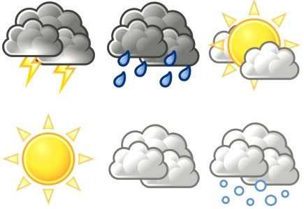

<h1>Weather Prediction</h1> 

This is a Machine Learning project which predicts weather condition from image. The project consist of 2 parts desktop and mobile. In desktop part, dataset is trained and model is saved. In mobile-android- part, trained model is used for prediction.

Tensorflow is the most popular and efficient library for machine learning. It is also cross-platrom library so that it can be used for android devices. That is why I use Tensorflow.

We have 5 classes: Cloudy, Sunny, Rainy, Snowy and Foggy. And their accuracy is below: 
Cloudy: %73.91 
Sunny: %90.00 
Rainy: %60.79 
Snowy: %71.73 
Foggy: %66.46 
General Accuracy: %72.08

